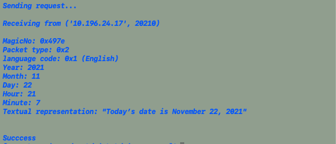

# time_server
A server returns time when a client asks for it using socket for communication.
This server supports three languages: English, Maori, German.

## Prerequisite
Please make sure [Python3](https://www.python.org/downloads/) is installed.
Also, please make sure network connection is stable. 

## Run
**Please set up server first before sending request from client.**
### Server
Supply three port numbers for English, Maori, German.
Port numbers need to be distinct and in [1024, 64000]
```
python3 server.py [port-1] [port-2] [port-3]
```
### Client
request-type: "date" or "time"
server-hostname: IP address or server name
server-port: a port number in [1024, 64000]
```
python3 client.py [request-type] [server-hostname] [server-port]
```

## Example
<br>
*(Figure1 When run without arguments, a prompt is given)*

<br>
*(Figure2 Date is returned in English)*

<br>
*(Figure3 Time is returned in Maori)*

<br>
*(Figure4 Time is returned in German)*

